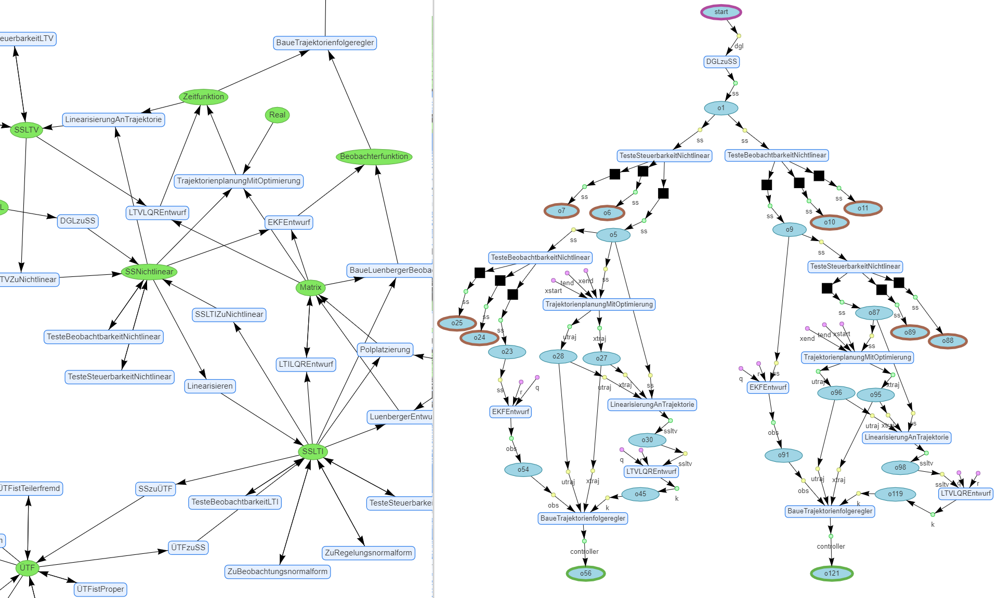

# Methodnet – A Formalized Representation of Control Theoretic Methods

## General Information

This repository contains software which aims to support problem solving in the field of automatic control by providing suitable access to domain specific knowledge, e.g. in form of a method-network.

The user interface is implemented as a django web application.

While code and interface are written in English, the contents of the method net are currently authored in German.

[Click here to visit an interactive demo of the web application right in your browser.](https://methodnet.ackrep.org/)

Disclaimer: This software is still in early stage of development and not yet officially released.
The project should be seen as a starting point and not a complete solution.
Please join the Discussion page to begin contributing.

## Screenshot

## Research context

An artice on this topic is being presented at [VDI Mechatronik conference 2021](https://www.vdi-mechatroniktagung.de/)
under the title __“Formal Semantic Representation of Methods in Automatic Control”__
by Robert Heedt, Carsten Knoll, Klaus Röbenack (TU Dresden, Institute of Control Theory).

_Abstract_:  
Written knowledge about automatic control theory is hard to access as it requires familiarity with the exact terminology.
Therefore, we propose the “method net”, a supplement to classical knowledge representation, consisting of types and
methods in a graph structure. From that, a schematic solution procedure can be generated for a specific problem. Trajectory
tracking control for a triple pendulum is used to demonstrate how the proposed methode supports knowledge transfer.

## Development

- We use *NPM* for management of Javascript libraries.
- Install all dependencies (specified in `package.json`): `npm install` (in the main directory)
  - → This creates a directory `node_modules` which is comparable to the virtual env directory in python
- We use *esbuild* to build a bundle (single file with own code and all dependencies) that is finally served as `/static/ackbas_core/main.js`.
- Own code lives in `ackbas_core/ts/index.ts` (typescript which will be compiled to JS during build).
- Build : run `npm run build` after changing `ackbas_core/ts/index.ts`.
- Watch mode : run `npm run watch` to start *esbuild* in watch mode, which recompiles the typescript code automatically when it changes.

## Further relevant docs

- https://json-schema.org/understanding-json-schema/
